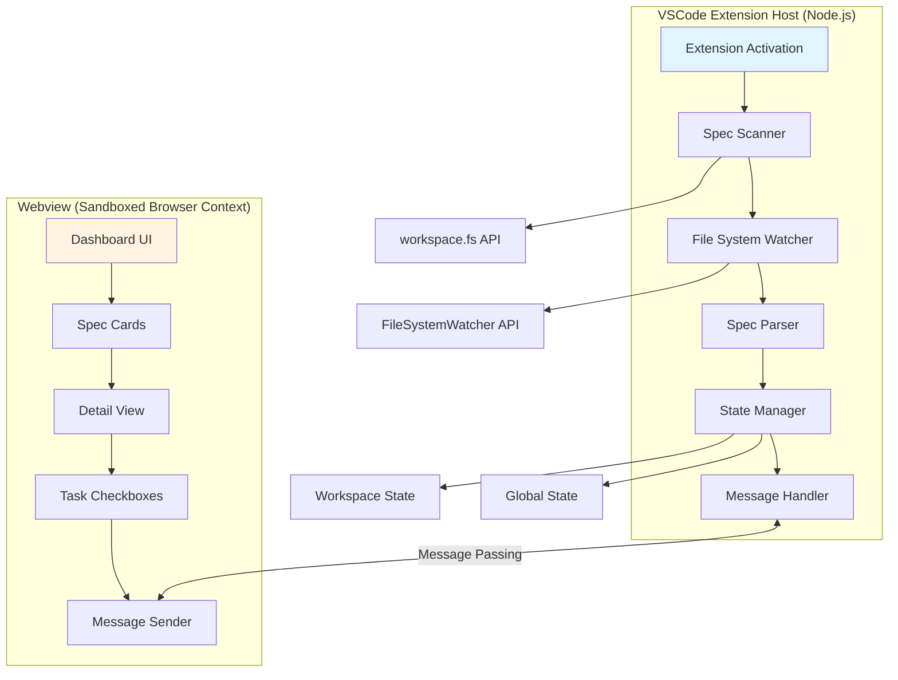
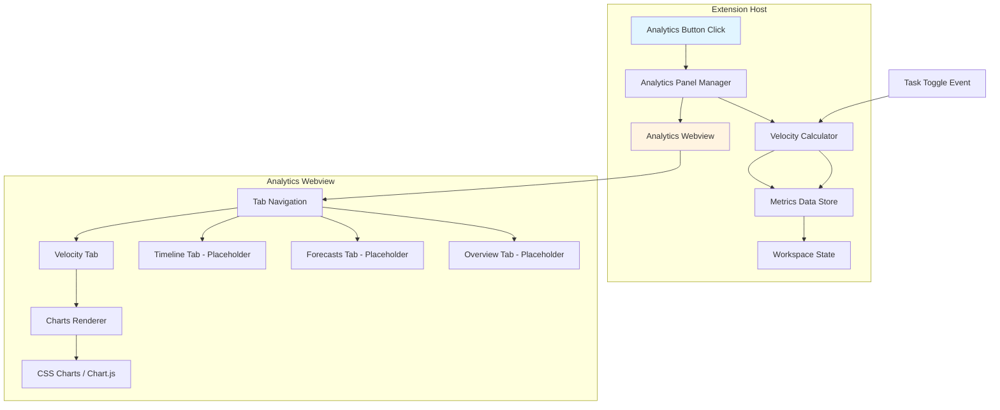

# Design Document: Specs Dashboard Extension

## Overview

The Specs Dashboard Extension is a VSCode extension that brings spec visualization and tracking directly into the IDE. The architecture follows VSCode's extension model with a clear separation between the Extension Host (Node.js process with VSCode API access) and the Webview (sandboxed UI rendering context). The extension automatically discovers `.kiro/specs/` directories, monitors file changes in real-time, and provides an interactive dashboard for viewing and managing spec progress.

The design reuses the core UI logic from the browser-based dashboard while adapting the data layer to use VSCode APIs. This parallel implementation strategy allows both versions to coexist and evolve independently while sharing conceptual patterns.

## Architecture

### High-Level Architecture



### Component Responsibilities

**Extension Host Components:**
- **Extension Activation**: Registers commands, initializes providers, sets up activation events
- **Spec Scanner**: Recursively scans `.kiro/specs/` directories and reads spec files
- **File System Watcher**: Monitors `.kiro/specs/**/*.md` for changes
- **Spec Parser**: Parses markdown files and extracts task status, progress metrics
- **State Manager**: Persists and retrieves workspace/global state
- **Message Handler**: Manages bidirectional communication with webview

**Webview Components:**
- **Dashboard UI**: Main interface with filtering, search, pagination
- **Spec Cards**: Visual representation of each spec with progress bars
- **Detail View**: Full spec viewer with tabbed sections (Requirements, Design, Tasks)
- **Task Checkboxes**: Interactive elements for toggling task completion
- **Message Sender**: Sends user actions to Extension Host

### Data Flow

1. **Initialization Flow**:
   - Extension activates → Scan workspace for `.kiro/specs/` → Parse spec files → Send data to webview → Render UI

2. **File Change Flow**:
   - File modified → Watcher triggers → Re-parse affected spec → Update state → Send update to webview → Re-render affected cards

3. **User Interaction Flow**:
   - User clicks task checkbox → Webview sends message → Extension Host updates file → File watcher triggers → Updated data sent back → UI updates

## Components and Interfaces

### Extension Entry Point (extension.ts)

```typescript
interface ExtensionContext {
  subscriptions: Disposable[];
  globalState: Memento;
  workspaceState: Memento;
  extensionUri: Uri;
}

function activate(context: ExtensionContext): void {
  // Register commands
  const showDashboardCommand = vscode.commands.registerCommand(
    'specs-dashboard.show',
    () => SpecsDashboardProvider.createOrShow(context.extensionUri)
  );
  
  const refreshCommand = vscode.commands.registerCommand(
    'specs-dashboard.refresh',
    () => SpecsDashboardProvider.refresh()
  );
  
  // Register webview provider
  const provider = new SpecsDashboardProvider(context);
  
  // Set up file system watcher
  const watcher = vscode.workspace.createFileSystemWatcher(
    '**/.kiro/specs/**/*.md'
  );
  
  watcher.onDidChange(() => provider.refresh());
  watcher.onDidCreate(() => provider.refresh());
  watcher.onDidDelete(() => provider.refresh());
  
  context.subscriptions.push(
    showDashboardCommand,
    refreshCommand,
    provider,
    watcher
  );
}

function deactivate(): void {
  // Cleanup handled by subscriptions disposal
}
```

### Spec Scanner (specScanner.ts)

```typescript
interface SpecFile {
  name: string;
  path: string;
  tasksContent?: string;
  requirementsContent?: string;
  designContent?: string;
  totalTasks: number;
  completedTasks: number;
  optionalTasks: number;
  progress: number;
}

class SpecScanner {
  async scanWorkspace(): Promise<SpecFile[]> {
    const specs: SpecFile[] = [];
    const workspaceFolders = vscode.workspace.workspaceFolders;
    
    if (!workspaceFolders) {
      return specs;
    }
    
    for (const folder of workspaceFolders) {
      const specsPath = vscode.Uri.joinPath(folder.uri, '.kiro', 'specs');
      
      try {
        const entries = await vscode.workspace.fs.readDirectory(specsPath);
        
        for (const [name, type] of entries) {
          if (type === vscode.FileType.Directory) {
            const spec = await this.parseSpecDirectory(specsPath, name);
            if (spec) {
              specs.push(spec);
            }
          }
        }
      } catch (error) {
        // .kiro/specs doesn't exist in this workspace folder
        continue;
      }
    }
    
    return specs;
  }
  
  private async parseSpecDirectory(
    basePath: Uri,
    name: string
  ): Promise<SpecFile | null> {
    const specPath = vscode.Uri.joinPath(basePath, name);
    const tasksUri = vscode.Uri.joinPath(specPath, 'tasks.md');
    
    try {
      const tasksContent = await this.readFile(tasksUri);
      const requirementsContent = await this.readFile(
        vscode.Uri.joinPath(specPath, 'requirements.md')
      );
      const designContent = await this.readFile(
        vscode.Uri.joinPath(specPath, 'design.md')
      );
      
      const taskStats = this.parseTaskStats(tasksContent);
      
      return {
        name,
        path: specPath.fsPath,
        tasksContent,
        requirementsContent,
        designContent,
        ...taskStats
      };
    } catch (error) {
      // tasks.md is required, skip if missing
      return null;
    }
  }
  
  private async readFile(uri: Uri): Promise<string | undefined> {
    try {
      const bytes = await vscode.workspace.fs.readFile(uri);
      return Buffer.from(bytes).toString('utf8');
    } catch {
      return undefined;
    }
  }
  
  private parseTaskStats(content: string): {
    totalTasks: number;
    completedTasks: number;
    optionalTasks: number;
    progress: number;
  } {
    const lines = content.split('\n');
    let totalTasks = 0;
    let completedTasks = 0;
    let optionalTasks = 0;
    
    for (const line of lines) {
      const trimmed = line.trim();
      
      // Match task checkboxes: - [ ], - [x], - [ ]*, - [x]*
      const taskMatch = trimmed.match(/^-\s*\[([ x])\](\*)?/);
      
      if (taskMatch) {
        const isCompleted = taskMatch[1] === 'x';
        const isOptional = taskMatch[2] === '*';
        
        totalTasks++;
        if (isCompleted) completedTasks++;
        if (isOptional) optionalTasks++;
      }
    }
    
    const progress = totalTasks > 0 
      ? Math.round((completedTasks / totalTasks) * 100) 
      : 0;
    
    return { totalTasks, completedTasks, optionalTasks, progress };
  }
}
```

### Webview Provider (specsDashboardProvider.ts)

```typescript
class SpecsDashboardProvider implements vscode.WebviewViewProvider {
  private static instance?: SpecsDashboardProvider;
  private view?: vscode.WebviewView;
  private scanner: SpecScanner;
  private specs: SpecFile[] = [];
  
  constructor(private context: vscode.ExtensionContext) {
    this.scanner = new SpecScanner();
    SpecsDashboardProvider.instance = this;
  }
  
  static createOrShow(extensionUri: vscode.Uri): void {
    if (SpecsDashboardProvider.instance?.view) {
      SpecsDashboardProvider.instance.view.show?.(true);
    }
  }
  
  static refresh(): void {
    SpecsDashboardProvider.instance?.loadSpecs();
  }
  
  async resolveWebviewView(
    webviewView: vscode.WebviewView,
    context: vscode.WebviewViewResolveContext,
    token: vscode.CancellationToken
  ): Promise<void> {
    this.view = webviewView;
    
    webviewView.webview.options = {
      enableScripts: true,
      localResourceRoots: [this.context.extensionUri]
    };
    
    webviewView.webview.html = this.getHtmlContent(webviewView.webview);
    
    // Set up message handling
    webviewView.webview.onDidReceiveMessage(
      message => this.handleMessage(message),
      undefined,
      this.context.subscriptions
    );
    
    // Load initial data
    await this.loadSpecs();
  }
  
  private async loadSpecs(): Promise<void> {
    this.specs = await this.scanner.scanWorkspace();
    
    if (this.view) {
      this.view.webview.postMessage({
        type: 'specsLoaded',
        specs: this.specs
      });
    }
  }
  
  private async handleMessage(message: any): Promise<void> {
    switch (message.type) {
      case 'toggleTask':
        await this.toggleTask(message.specName, message.taskLine);
        break;
      
      case 'openFile':
        await this.openFile(message.filePath);
        break;
      
      case 'requestSpecs':
        await this.loadSpecs();
        break;
    }
  }
  
  private async toggleTask(specName: string, taskLine: number): Promise<void> {
    const spec = this.specs.find(s => s.name === specName);
    if (!spec || !spec.tasksContent) return;
    
    const lines = spec.tasksContent.split('\n');
    const line = lines[taskLine];
    
    if (!line) return;
    
    // Toggle checkbox state
    const updatedLine = line.includes('- [x]')
      ? line.replace('- [x]', '- [ ]')
      : line.replace('- [ ]', '- [x]');
    
    lines[taskLine] = updatedLine;
    const updatedContent = lines.join('\n');
    
    // Write back to file
    const tasksUri = vscode.Uri.file(spec.path).with({
      path: `${spec.path}/tasks.md`
    });
    
    await vscode.workspace.fs.writeFile(
      tasksUri,
      Buffer.from(updatedContent, 'utf8')
    );
    
    // File watcher will trigger refresh automatically
  }
  
  private async openFile(filePath: string): Promise<void> {
    const uri = vscode.Uri.file(filePath);
    await vscode.window.showTextDocument(uri);
  }
  
  private getHtmlContent(webview: vscode.Webview): string {
    // Generate nonce for CSP
    const nonce = this.getNonce();
    
    // Get URIs for external libraries
    const markedUri = webview.asWebviewUri(
      vscode.Uri.joinPath(this.context.extensionUri, 'media', 'marked.min.js')
    );
    const highlightJsUri = webview.asWebviewUri(
      vscode.Uri.joinPath(this.context.extensionUri, 'media', 'highlight.min.js')
    );
    const highlightCssUri = webview.asWebviewUri(
      vscode.Uri.joinPath(this.context.extensionUri, 'media', 'highlight.css')
    );
    const mermaidUri = webview.asWebviewUri(
      vscode.Uri.joinPath(this.context.extensionUri, 'media', 'mermaid.min.js')
    );
    
    return `<!DOCTYPE html>
    <html lang="en">
    <head>
      <meta charset="UTF-8">
      <meta name="viewport" content="width=device-width, initial-scale=1.0">
      <meta http-equiv="Content-Security-Policy" 
            content="default-src 'none'; 
                     style-src ${webview.cspSource} 'unsafe-inline'; 
                     script-src 'nonce-${nonce}'; 
                     img-src ${webview.cspSource} https:;">
      <link rel="stylesheet" href="${highlightCssUri}">
      <title>Specs Dashboard</title>
      <style nonce="${nonce}">
        /* Dashboard styles adapted from index.html */
        /* ... CSS content ... */
      </style>
    </head>
    <body>
      <div id="app">
        <!-- Dashboard UI structure -->
      </div>
      
      <script nonce="${nonce}" src="${markedUri}"></script>
      <script nonce="${nonce}" src="${highlightJsUri}"></script>
      <script nonce="${nonce}" src="${mermaidUri}"></script>
      <script nonce="${nonce}">
        // Dashboard JavaScript adapted from index.html
        // Message passing integration
        const vscode = acquireVsCodeApi();
        
        // Request initial data
        vscode.postMessage({ type: 'requestSpecs' });
        
        // Handle messages from extension
        window.addEventListener('message', event => {
          const message = event.data;
          
          switch (message.type) {
            case 'specsLoaded':
              renderSpecs(message.specs);
              break;
          }
        });
        
        // Send task toggle to extension
        function toggleTask(specName, taskLine) {
          vscode.postMessage({
            type: 'toggleTask',
            specName,
            taskLine
          });
        }
        
        // ... rest of dashboard logic ...
      </script>
    </body>
    </html>`;
  }
  
  private getNonce(): string {
    let text = '';
    const possible = 'ABCDEFGHIJKLMNOPQRSTUVWXYZabcdefghijklmnopqrstuvwxyz0123456789';
    for (let i = 0; i < 32; i++) {
      text += possible.charAt(Math.floor(Math.random() * possible.length));
    }
    return text;
  }
  
  dispose(): void {
    // Cleanup
  }
}
```

### State Manager (stateManager.ts)

```typescript
interface DashboardState {
  filterMode: 'all' | 'in-progress' | 'completed';
  searchQuery: string;
  currentPage: number;
  itemsPerPage: number;
  sortBy: 'name' | 'progress';
  sortOrder: 'asc' | 'desc';
}

class StateManager {
  private workspaceState: vscode.Memento;
  private globalState: vscode.Memento;
  
  constructor(context: vscode.ExtensionContext) {
    this.workspaceState = context.workspaceState;
    this.globalState = context.globalState;
  }
  
  async getDashboardState(): Promise<DashboardState> {
    return this.workspaceState.get('dashboardState', {
      filterMode: 'all',
      searchQuery: '',
      currentPage: 1,
      itemsPerPage: 10,
      sortBy: 'name',
      sortOrder: 'asc'
    });
  }
  
  async saveDashboardState(state: DashboardState): Promise<void> {
    await this.workspaceState.update('dashboardState', state);
  }
  
  async getGlobalPreferences(): Promise<any> {
    return this.globalState.get('preferences', {});
  }
  
  async saveGlobalPreferences(preferences: any): Promise<void> {
    await this.globalState.update('preferences', preferences);
  }
}
```

## Data Models

### SpecFile Model

```typescript
interface SpecFile {
  // Identity
  name: string;              // Spec directory name (kebab-case)
  path: string;              // Absolute file system path
  workspaceFolder?: string;  // Workspace folder name (for multi-root)
  
  // Content
  tasksContent?: string;         // Raw markdown content
  requirementsContent?: string;  // Raw markdown content
  designContent?: string;        // Raw markdown content
  
  // Metrics
  totalTasks: number;       // Total task count
  completedTasks: number;   // Completed task count
  optionalTasks: number;    // Optional task count (marked with *)
  progress: number;         // Percentage (0-100)
  
  // Metadata
  lastModified?: Date;      // Last modification timestamp
}
```

### Task Model

```typescript
interface Task {
  line: number;           // Line number in tasks.md
  text: string;           // Task description
  completed: boolean;     // Checkbox state
  optional: boolean;      // Has * marker
  level: number;          // Indentation level (0 = top-level)
  parent?: number;        // Parent task line number
}
```

### Message Protocol

```typescript
// Extension Host → Webview
type ExtensionMessage =
  | { type: 'specsLoaded'; specs: SpecFile[] }
  | { type: 'specUpdated'; spec: SpecFile }
  | { type: 'error'; message: string };

// Webview → Extension Host
type WebviewMessage =
  | { type: 'requestSpecs' }
  | { type: 'toggleTask'; specName: string; taskLine: number }
  | { type: 'openFile'; filePath: string }
  | { type: 'saveState'; state: DashboardState };
```

## Correctness Properties

*A property is a characteristic or behavior that should hold true across all valid executions of a system—essentially, a formal statement about what the system should do. Properties serve as the bridge between human-readable specifications and machine-verifiable correctness guarantees.*


### Property 1: Workspace Scanning Completeness

*For any* workspace containing `.kiro/specs/` directories with spec files, the Extension_Host should discover and parse all spec directories, returning a complete list of SpecFile objects with accurate task counts and progress metrics.

**Validates: Requirements 1.1, 2.2, 2.5**

### Property 2: Graceful Error Recovery

*For any* spec directory where file read operations fail or files are missing, the Extension_Host should log the error, skip that specific file, and continue processing all other specs without interruption.

**Validates: Requirements 2.4, 11.2**

### Property 3: File Change Propagation

*For any* file modification in `.kiro/specs/**/*.md`, the File_System_Watcher should trigger a refresh event, causing the Extension_Host to re-parse the affected spec and send updated data to the Webview, resulting in UI updates.

**Validates: Requirements 3.2, 3.3, 3.4**

### Property 4: State Persistence Round-Trip

*For any* dashboard state (filter mode, search query, pagination, sort preferences), saving the state then reloading the extension should restore the exact same state from Workspace_State.

**Validates: Requirements 4.3, 4.4, 14.4, 14.5**

### Property 5: Task Toggle Round-Trip

*For any* task checkbox in the Webview, clicking it should send a message to the Extension_Host, update the tasks.md file, trigger the file watcher, and send updated spec data back to the Webview, resulting in the UI reflecting the new checkbox state.

**Validates: Requirements 6.3, 6.4, 8.1, 8.2, 8.4, 8.5**

### Property 6: Markdown Formatting Preservation

*For any* tasks.md file, toggling a task checkbox should only modify the checkbox state (`[ ]` ↔ `[x]`) while preserving all other markdown formatting, whitespace, and content exactly as it was.

**Validates: Requirements 8.3**

### Property 7: Spec Card Rendering Completeness

*For any* SpecFile object, the rendered spec card in the Webview should contain all required elements: spec name, progress bar, total task count, completed task count, and progress percentage.

**Validates: Requirements 5.3**

### Property 8: Request-Response Message Protocol

*For any* message sent from the Webview requesting spec data, the Extension_Host should respond with a message containing current spec information within a reasonable timeout.

**Validates: Requirements 6.2**

### Property 9: GitHub Flavored Markdown Rendering

*For any* valid GitHub Flavored Markdown content (tables, task lists, strikethrough, autolinks), the Webview should render it according to GFM specifications.

**Validates: Requirements 7.4**

### Property 10: Syntax Highlighting Application

*For any* code block with a language identifier, the Webview should apply syntax highlighting using the appropriate language grammar from highlight.js.

**Validates: Requirements 7.5**

### Property 11: Message Origin Validation

*For any* message received by the Webview, if the message origin is not from the Extension_Host, the message should be rejected and not processed.

**Validates: Requirements 10.4**

### Property 12: Content Sanitization

*For any* user-provided content (spec names, task descriptions, markdown content), the Extension_Host should sanitize it before rendering in the Webview to prevent XSS attacks.

**Validates: Requirements 10.5**

### Property 13: Error Notification Display

*For any* file operation failure (read, write, delete), the Extension_Host should display a VSCode error notification with a descriptive message indicating what failed and why.

**Validates: Requirements 11.1**

### Property 14: Rendering Error Fallback

*For any* rendering error in the Webview (invalid markdown, script errors), the Webview should display fallback content instead of crashing and report the error to the Extension_Host.

**Validates: Requirements 11.3**

### Property 15: Workspace State Isolation

*For any* two different workspaces opened in VSCode, changes to dashboard state in one workspace should not affect the dashboard state in the other workspace.

**Validates: Requirements 12.1, 12.2**

### Property 16: Multi-Root Workspace Scanning

*For any* multi-root workspace where multiple folders contain `.kiro/specs/` directories, the Extension_Host should scan all workspace folders and return specs from all folders with workspace folder indicators.

**Validates: Requirements 12.4, 12.5**

### Property 17: File System Event Debouncing

*For any* sequence of rapid file changes (multiple edits within a short time window), the Extension_Host should debounce the events and trigger at most one re-parse operation after the changes settle.

**Validates: Requirements 13.1**

### Property 18: Webview Pause on Hide

*For any* non-critical background operation, when the webview is hidden, the Extension_Host should pause the operation, and when the webview is shown again, the operation should resume.

**Validates: Requirements 13.5**

### Property 19: Search Filtering Behavior

*For any* search query entered in the search input, the Webview should update the displayed spec list to show only specs whose name or content contains the search query (case-insensitive).

**Validates: Requirements 14.2**

### Property 20: Detail View Navigation

*For any* spec in the detail view, using navigation controls should allow moving to the previous or next spec without closing the detail view, maintaining the current tab selection.

**Validates: Requirements 15.4**

### Property 21: Inline Task Toggling

*For any* task displayed in the detail view, clicking the checkbox should toggle its completion state and immediately update both the file and the UI without requiring a page refresh.

**Validates: Requirements 15.5**

## Error Handling

### Error Categories

**File System Errors:**
- Missing `.kiro/specs/` directory → Log info message, show empty state in UI
- Missing tasks.md → Skip spec, log warning
- Missing requirements.md or design.md → Set content to undefined, continue
- File read permission denied → Show error notification, skip file
- File write permission denied → Show error notification, prevent task toggle

**Parsing Errors:**
- Invalid markdown syntax → Render as-is, log warning
- Malformed task checkboxes → Skip task, log warning
- Invalid UTF-8 encoding → Show error notification, skip file

**Webview Errors:**
- Script execution errors → Display fallback UI, report to Extension Host
- Message passing timeout → Retry up to 3 times, then show error
- CSP violations → Log error, block resource

**State Errors:**
- Corrupted workspace state → Reset to defaults, log warning
- Invalid state schema → Reset to defaults, log warning
- State migration failures → Use defaults, log error

### Error Recovery Strategies

**Graceful Degradation:**
- If requirements.md or design.md are missing, show only tasks tab
- If all specs fail to load, show helpful "Getting Started" message
- If file watcher fails, fall back to manual refresh only

**User Feedback:**
- All file operation errors show VSCode notifications
- Parsing warnings appear in Output panel
- Critical errors trigger error messages with actionable steps

**Retry Logic:**
- File read operations: Retry once after 100ms delay
- Message passing: Retry up to 3 times with exponential backoff
- File write operations: No automatic retry (user must retry manually)

## Testing Strategy

### Dual Testing Approach

The extension will use both unit tests and property-based tests to ensure comprehensive coverage:

**Unit Tests** focus on:
- Specific examples of spec parsing (valid tasks.md, missing files)
- Edge cases (empty directories, corrupted state, invalid markdown)
- Integration points (VSCode API mocking, message passing)
- Error conditions (file permission errors, network timeouts)

**Property-Based Tests** focus on:
- Universal properties across all inputs (scanning, parsing, state persistence)
- Round-trip properties (state save/restore, task toggle)
- Invariants (markdown preservation, state isolation)
- Comprehensive input coverage through randomization

### Property-Based Testing Configuration

**Testing Library:** fast-check (TypeScript property-based testing library)

**Test Configuration:**
- Minimum 100 iterations per property test
- Each test tagged with: `Feature: specs-dashboard-extension, Property {N}: {property_text}`
- Seed-based reproducibility for failed tests
- Shrinking enabled to find minimal failing examples

**Example Property Test Structure:**

```typescript
import * as fc from 'fast-check';

// Feature: specs-dashboard-extension, Property 6: Markdown Formatting Preservation
test('toggling task checkbox preserves other markdown formatting', () => {
  fc.assert(
    fc.property(
      fc.string(), // arbitrary markdown content
      fc.nat(),    // arbitrary task line number
      (markdownContent, taskLine) => {
        const original = markdownContent;
        const toggled = toggleTaskCheckbox(markdownContent, taskLine);
        const restored = toggleTaskCheckbox(toggled, taskLine);
        
        // Only checkbox state should change, everything else preserved
        expect(removeCheckboxes(original)).toEqual(removeCheckboxes(restored));
      }
    ),
    { numRuns: 100 }
  );
});
```

### Unit Test Coverage

**Core Components:**
- SpecScanner: Test directory scanning, file reading, task parsing
- SpecsDashboardProvider: Test webview creation, message handling
- StateManager: Test state persistence, retrieval, defaults
- Task parsing: Test checkbox detection, progress calculation

**Integration Tests:**
- Extension activation flow
- File watcher → parser → webview update flow
- Task toggle → file write → watcher → UI update flow
- Multi-workspace state isolation

**Edge Cases:**
- Empty workspace (no .kiro/specs)
- Malformed tasks.md files
- Rapid file changes (debouncing)
- Corrupted state recovery
- Missing optional files

### Testing Tools

- **Jest**: Unit test runner
- **fast-check**: Property-based testing library
- **@vscode/test-electron**: VSCode extension testing framework
- **Mock VSCode APIs**: For isolated unit testing

### Continuous Testing

- Run unit tests on every commit
- Run property tests on pull requests
- Integration tests in CI/CD pipeline
- Manual testing checklist for UI interactions

## Native IDE Design System

### Design Philosophy

The dashboard should feel like a native IDE component, not a web application embedded in the IDE. This means:

1. **Use IDE Design Language**: Follow VSCode's flat, minimalist aesthetic
2. **Respect IDE Themes**: Adapt automatically to light/dark themes using CSS variables
3. **Information Density**: Maximize visible information, minimize decorative elements
4. **Native Interactions**: Use IDE-standard hover states, focus indicators, and keyboard navigation
5. **Consistent Patterns**: Match existing IDE panels (Explorer, Search, Extensions)

### VSCode CSS Variables Reference

**Colors:**
```css
/* Foreground/Background */
--vscode-foreground
--vscode-background
--vscode-descriptionForeground

/* Interactive Elements */
--vscode-button-background
--vscode-button-foreground
--vscode-button-hoverBackground
--vscode-input-background
--vscode-input-foreground
--vscode-input-border

/* Lists */
--vscode-list-activeSelectionBackground
--vscode-list-activeSelectionForeground
--vscode-list-hoverBackground
--vscode-list-inactiveSelectionBackground

/* Badges */
--vscode-badge-background
--vscode-badge-foreground

/* Progress Bars */
--vscode-progressBar-background

/* Borders */
--vscode-panel-border
--vscode-widget-border

/* Status Colors */
--vscode-testing-iconPassed
--vscode-testing-iconFailed
--vscode-charts-yellow
```

**Typography:**
```css
--vscode-font-family          /* UI text */
--vscode-font-size            /* Usually 13px */
--vscode-editor-font-family   /* Monospace for code */
--vscode-editor-font-size     /* Usually 14px */
```

**Spacing:**
- Use multiples of 4px: 4px, 8px, 12px, 16px, 20px
- Compact spacing for list items: 4px-8px vertical padding
- Standard spacing for sections: 12px-16px

### Component Patterns

**List Items (Spec Cards):**
```
┌─────────────────────────────────────────┐
│ ▸ spec-name                    [badge]  │
│   folder-path                           │
│   ▓▓▓▓▓▓▓▓░░░░░░░░░░ 45%               │
│   12 completed • 15 pending             │
└─────────────────────────────────────────┘
```

**Statistics Header:**
```
┌─────────────────────────────────────────┐
│ 119 completed • 64 pending • 65% total  │
└─────────────────────────────────────────┘
```

**Filter Controls:**
```
┌─────────────────────────────────────────┐
│ [Search: Filter by name...            ] │
│ [All] [In Progress] [Completed]         │
└─────────────────────────────────────────┘
```

### Icon Usage (Codicons)

Use VSCode's Codicon font for all icons:
- `$(chevron-right)` - Collapsed state
- `$(chevron-down)` - Expanded state
- `$(refresh)` - Refresh action
- `$(filter)` - Filter action
- `$(check)` - Completed status
- `$(circle-outline)` - Pending status
- `$(loading~spin)` - Loading indicator
- `$(file)` - File/document icon
- `$(folder)` - Folder icon
- `$(go-to-file)` - Open file action
- `$(edit)` - Edit file action

### Quick File Access Buttons

Each spec should provide quick access to open its markdown files directly in the editor:

**Button Placement:**
```
┌─────────────────────────────────────────┐
│ ▸ spec-name                    [badge]  │
│   folder-path                           │
│   $(file) $(edit) $(list-unordered)    │ ← Quick access buttons
│   ▓▓▓▓▓▓▓▓░░░░░░░░░░ 45%               │
│   12 completed • 15 pending             │
└─────────────────────────────────────────┘
```

**Button Icons:**
- `$(file)` - Open requirements.md
- `$(edit)` - Open design.md  
- `$(list-unordered)` - Open tasks.md

**Button Behavior:**
- Inline icon buttons (16x16px)
- Hover reveals tooltip with file name
- Click sends message to Extension Host to open file
- Disabled/hidden if file doesn't exist
- Uses `--vscode-button-foreground` color
- Hover uses `--vscode-button-hoverBackground`

**Alternative Placement (Detail View):**
```
┌─────────────────────────────────────────┐
│ Spec Name                               │
│ [Requirements $(go-to-file)] [Design $(go-to-file)] [Tasks $(go-to-file)] │
│ ─────────────────────────────────────── │
│ Tab content...                          │
└─────────────────────────────────────────┘
```

### Layout Principles

1. **Full-Width Layouts**: No centered containers, use full sidebar width
2. **Edge-to-Edge**: Content extends to panel edges with minimal padding
3. **Flat Hierarchy**: Avoid nested cards, use flat lists with indentation
4. **Subtle Separators**: 1px borders using `--vscode-panel-border`
5. **No Shadows**: Flat design, no box-shadows or elevation
6. **Minimal Borders**: Only where necessary for visual separation
7. **Compact Spacing**: Reduce whitespace, increase information density

### Interaction Patterns

**Hover States:**
- Background: `--vscode-list-hoverBackground`
- No border changes, no shadows
- Instant transition (no animation)

**Focus States:**
- Border: `2px solid var(--vscode-focusBorder)`
- No background change
- Visible keyboard focus indicator

**Active/Selected States:**
- Background: `--vscode-list-activeSelectionBackground`
- Foreground: `--vscode-list-activeSelectionForeground`
- No additional styling

**Disabled States:**
- Opacity: 0.4
- Cursor: not-allowed
- No interaction

### Theme Adaptation

The dashboard must work seamlessly with all VSCode themes:

**Dark Themes:**
- Use dark background variables
- Ensure sufficient contrast for text
- Use subtle borders (low opacity)

**Light Themes:**
- Use light background variables
- Ensure text remains readable
- Use slightly darker borders

**High Contrast Themes:**
- Respect high contrast color variables
- Ensure all interactive elements are clearly visible
- Use stronger borders and focus indicators

### Anti-Patterns to Avoid

❌ **Don't:**
- Use custom color palettes (hex codes, rgb values)
- Add box-shadows or drop shadows
- Use rounded corners (border-radius)
- Center content with max-width containers
- Add gradient backgrounds
- Use decorative animations or transitions
- Implement card-style layouts
- Use large padding/margins
- Add custom fonts
- Create website-style navigation

✅ **Do:**
- Use VSCode CSS variables exclusively
- Implement flat, edge-to-edge layouts
- Use list-based component patterns
- Follow IDE spacing conventions
- Adapt to all themes automatically
- Use Codicons for all icons
- Implement compact, information-dense designs
- Match existing IDE panel aesthetics
- Use subtle, functional styling
- Follow VSCode design guidelines


## Analytics Feature Design

### Overview

The Analytics feature provides velocity metrics and productivity insights through a dedicated panel that opens in the main editor area. The feature tracks task completion events over time and calculates various metrics to help developers understand their work patterns and productivity trends.

### Architecture



### Data Model

#### Velocity Data Structure

```typescript
interface VelocityData {
  // Weekly task completion history
  weeklyTasks: WeeklyTaskData[];
  
  // Spec completion history
  weeklySpecs: WeeklySpecData[];
  
  // Spec activity tracking
  specActivity: Map<string, SpecActivityData>;
  
  // Day of week aggregation
  dayOfWeekTasks: DayOfWeekData;
}

interface WeeklyTaskData {
  weekStart: Date;        // Monday of the week
  weekEnd: Date;          // Sunday of the week
  completed: number;      // Tasks completed this week
  required: number;       // Required tasks completed
  optional: number;       // Optional tasks completed
}

interface WeeklySpecData {
  weekStart: Date;
  weekEnd: Date;
  completed: number;      // Specs that reached 100%
  started: number;        // Specs that had first task completed
}

interface SpecActivityData {
  firstTaskDate: Date | null;    // When first task was completed
  lastTaskDate: Date | null;     // When last task was completed
  completionDate: Date | null;   // When spec reached 100%
  totalTasks: number;
  completedTasks: number;
}

interface DayOfWeekData {
  monday: number;
  tuesday: number;
  wednesday: number;
  thursday: number;
  friday: number;
  saturday: number;
  sunday: number;
}
```

#### Calculated Metrics

```typescript
interface VelocityMetrics {
  // Core metrics
  tasksPerWeek: number[];              // Last 12 weeks
  currentWeekTasks: number;
  lastWeekTasks: number;
  velocityTrend: number;               // Percentage change
  averageVelocity: number;             // 4-week rolling average
  
  // Spec metrics
  specsPerWeek: number[];              // Last 8 weeks
  averageTimeToComplete: number;       // Days
  timeDistribution: {
    fast: number;      // 0-10 days
    medium: number;    // 11-20 days
    slow: number;      // 21+ days
  };
  
  // Projections
  projectedCompletionDate: Date | null;
  remainingTasks: number;
  daysRemaining: number;
  
  // Patterns
  dayOfWeekVelocity: DayOfWeekData;
  requiredVsOptional: {
    required: number;
    optional: number;
  };
  
  // Quality metrics
  consistencyScore: number;            // 0-100
  consistencyRating: 'High' | 'Medium' | 'Low';
}
```

### Component Design

#### Analytics Panel Manager

```typescript
class AnalyticsPanelManager {
  private panel: vscode.WebviewPanel | undefined;
  private velocityCalculator: VelocityCalculator;
  
  /**
   * Open or reveal the analytics panel
   */
  public openAnalytics(): void {
    if (this.panel) {
      this.panel.reveal(vscode.ViewColumn.One);
    } else {
      this.createPanel();
    }
    this.updateContent();
  }
  
  /**
   * Create the analytics webview panel
   */
  private createPanel(): void {
    this.panel = vscode.window.createWebviewPanel(
      'specsAnalytics',
      'Analytics - Kiro Specs Dashboard',
      vscode.ViewColumn.One,
      {
        enableScripts: true,
        retainContextWhenHidden: true
      }
    );
    
    this.panel.webview.html = this.getHtmlContent();
    this.setupMessageHandling();
    
    this.panel.onDidDispose(() => {
      this.panel = undefined;
    });
  }
  
  /**
   * Update analytics content with latest metrics
   */
  private updateContent(): void {
    const metrics = this.velocityCalculator.calculateMetrics();
    this.panel?.webview.postMessage({
      type: 'metricsUpdated',
      metrics: metrics
    });
  }
}
```

#### Velocity Calculator

```typescript
class VelocityCalculator {
  private velocityData: VelocityData;
  private stateManager: StateManager;
  
  /**
   * Record a task completion event
   */
  public recordTaskCompletion(
    specName: string,
    taskId: string,
    isRequired: boolean,
    timestamp: Date = new Date()
  ): void {
    // Update weekly tasks
    const week = this.getWeekStart(timestamp);
    const weekData = this.getOrCreateWeekData(week);
    weekData.completed++;
    if (isRequired) {
      weekData.required++;
    } else {
      weekData.optional++;
    }
    
    // Update day of week
    const dayName = this.getDayName(timestamp);
    this.velocityData.dayOfWeekTasks[dayName]++;
    
    // Update spec activity
    this.updateSpecActivity(specName, timestamp);
    
    // Persist to state
    this.stateManager.saveVelocityData(this.velocityData);
  }
  
  /**
   * Calculate all velocity metrics
   */
  public calculateMetrics(): VelocityMetrics {
    return {
      tasksPerWeek: this.getTasksPerWeek(12),
      currentWeekTasks: this.getCurrentWeekTasks(),
      lastWeekTasks: this.getLastWeekTasks(),
      velocityTrend: this.calculateTrend(),
      averageVelocity: this.calculateRollingAverage(4),
      specsPerWeek: this.getSpecsPerWeek(8),
      averageTimeToComplete: this.calculateAvgTimeToComplete(),
      timeDistribution: this.calculateTimeDistribution(),
      projectedCompletionDate: this.projectCompletionDate(),
      remainingTasks: this.getRemainingTasks(),
      daysRemaining: this.calculateDaysRemaining(),
      dayOfWeekVelocity: this.velocityData.dayOfWeekTasks,
      requiredVsOptional: this.calculateRequiredVsOptional(),
      consistencyScore: this.calculateConsistencyScore(),
      consistencyRating: this.getConsistencyRating()
    };
  }
  
  /**
   * Calculate velocity trend (current week vs last week)
   */
  private calculateTrend(): number {
    const current = this.getCurrentWeekTasks();
    const last = this.getLastWeekTasks();
    if (last === 0) return 0;
    return ((current - last) / last) * 100;
  }
  
  /**
   * Calculate rolling average velocity
   */
  private calculateRollingAverage(weeks: number): number {
    const recentWeeks = this.velocityData.weeklyTasks.slice(-weeks);
    const total = recentWeeks.reduce((sum, week) => sum + week.completed, 0);
    return total / weeks;
  }
  
  /**
   * Calculate consistency score based on standard deviation
   */
  private calculateConsistencyScore(): number {
    const tasks = this.getTasksPerWeek(8);
    const mean = tasks.reduce((a, b) => a + b, 0) / tasks.length;
    const variance = tasks.reduce((sum, val) => sum + Math.pow(val - mean, 2), 0) / tasks.length;
    const stdDev = Math.sqrt(variance);
    
    // Lower std dev = higher consistency
    // Normalize to 0-100 scale
    const maxStdDev = mean; // Assume max std dev equals mean
    const score = Math.max(0, 100 - (stdDev / maxStdDev) * 100);
    return Math.round(score);
  }
}
```

### UI Design

#### Analytics Button in Dashboard

```html
<!-- Added to dashboard stats section -->
<div class="stats-summary">
  <span>1 specs</span>
  <span>91 done</span>
  <span>16 todo</span>
  <span>85% total</span>
  <button class="analytics-button" onclick="openAnalytics()">
    <i class="codicon codicon-graph"></i>
    Analytics
  </button>
</div>
```

```css
.analytics-button {
  background: var(--vscode-button-background);
  color: var(--vscode-button-foreground);
  border: none;
  padding: 4px 12px;
  border-radius: 2px;
  cursor: pointer;
  display: inline-flex;
  align-items: center;
  gap: 6px;
  font-size: 13px;
}

.analytics-button:hover {
  background: var(--vscode-button-hoverBackground);
}
```

#### Analytics Panel Layout

```html
<div class="analytics-container">
  <!-- Tab Navigation -->
  <div class="analytics-tabs">
    <button class="tab active" data-tab="velocity">⚡ Velocity</button>
    <button class="tab" data-tab="timeline">📅 Timeline</button>
    <button class="tab" data-tab="forecasts">🎯 Forecasts</button>
    <button class="tab" data-tab="overview">📊 Overview</button>
  </div>
  
  <!-- Velocity Tab Content -->
  <div class="tab-content" id="velocity-tab">
    <!-- Hero Stats -->
    <div class="hero-stats">
      <div class="stat-card">
        <div class="stat-label">This Week</div>
        <div class="stat-value">12 tasks</div>
        <div class="stat-change positive">+50% ↑</div>
      </div>
      <div class="stat-card">
        <div class="stat-label">Average</div>
        <div class="stat-value">9.5 tasks/week</div>
        <div class="stat-sublabel">4-week rolling</div>
      </div>
      <div class="stat-card">
        <div class="stat-label">Consistency</div>
        <div class="stat-value">85%</div>
        <div class="stat-rating">High</div>
      </div>
    </div>
    
    <!-- Main Chart -->
    <div class="chart-section">
      <h3>Tasks Completed (Last 12 Weeks)</h3>
      <div class="bar-chart" id="tasks-chart"></div>
    </div>
    
    <!-- Secondary Metrics Grid -->
    <div class="metrics-grid">
      <div class="metric-card">
        <h4>Specs Completed</h4>
        <div class="mini-chart" id="specs-chart"></div>
      </div>
      <div class="metric-card">
        <h4>Avg Time to Complete</h4>
        <div class="metric-value">14 days</div>
        <div class="distribution">
          Fast: 3 | Medium: 5 | Slow: 2
        </div>
      </div>
      <div class="metric-card">
        <h4>Day of Week</h4>
        <div class="horizontal-bars" id="day-chart"></div>
      </div>
      <div class="metric-card">
        <h4>Required vs Optional</h4>
        <div class="stacked-bar">
          <div class="bar-segment required" style="width: 70%">70%</div>
          <div class="bar-segment optional" style="width: 30%">30%</div>
        </div>
      </div>
    </div>
    
    <!-- Projection -->
    <div class="projection-section">
      <h3>🔮 Projected Completion</h3>
      <div class="projection-content">
        <div class="projection-date">March 15, 2026 (6 weeks remaining)</div>
        <div class="progress-bar">
          <div class="progress-fill" style="width: 65%"></div>
        </div>
        <div class="projection-details">65% complete</div>
      </div>
    </div>
  </div>
  
  <!-- Placeholder Tabs -->
  <div class="tab-content hidden" id="timeline-tab">
    <div class="placeholder">
      <h2>Timeline View</h2>
      <p>Coming soon: Historical view of spec progress over time</p>
    </div>
  </div>
  
  <div class="tab-content hidden" id="forecasts-tab">
    <div class="placeholder">
      <h2>Forecasts</h2>
      <p>Coming soon: Predictive analytics and completion forecasts</p>
    </div>
  </div>
  
  <div class="tab-content hidden" id="overview-tab">
    <div class="placeholder">
      <h2>Overview Dashboard</h2>
      <p>Coming soon: High-level summary of all metrics</p>
    </div>
  </div>
</div>
```

### Chart Rendering

#### CSS-Based Bar Chart

```css
.bar-chart {
  display: flex;
  align-items: flex-end;
  height: 150px;
  gap: 8px;
  padding: 20px 10px;
  border: 1px solid var(--vscode-panel-border);
  border-radius: 4px;
}

.bar {
  flex: 1;
  background: var(--vscode-charts-blue);
  border-radius: 2px 2px 0 0;
  transition: all 0.3s ease;
  cursor: pointer;
  position: relative;
}

.bar.current {
  background: var(--vscode-charts-green);
}

.bar:hover {
  opacity: 0.8;
}

.bar::after {
  content: attr(data-value);
  position: absolute;
  top: -20px;
  left: 50%;
  transform: translateX(-50%);
  font-size: 11px;
  color: var(--vscode-foreground);
  opacity: 0;
  transition: opacity 0.2s;
}

.bar:hover::after {
  opacity: 1;
}
```

#### JavaScript Chart Generation

```javascript
function renderTasksChart(weeklyData) {
  const chartContainer = document.getElementById('tasks-chart');
  chartContainer.innerHTML = '';
  
  const maxTasks = Math.max(...weeklyData.map(w => w.completed));
  
  weeklyData.forEach((week, index) => {
    const bar = document.createElement('div');
    bar.className = 'bar';
    if (index === weeklyData.length - 1) {
      bar.classList.add('current');
    }
    
    const height = (week.completed / maxTasks) * 100;
    bar.style.height = `${height}%`;
    bar.setAttribute('data-value', week.completed);
    bar.setAttribute('title', `Week ${index + 1}: ${week.completed} tasks`);
    
    chartContainer.appendChild(bar);
  });
}
```

### State Persistence

```typescript
interface AnalyticsState {
  velocityData: VelocityData;
  lastActiveTab: string;
  lastCalculated: Date;
}

// Save to workspace state
await context.workspaceState.update('analyticsState', analyticsState);

// Load from workspace state
const analyticsState = context.workspaceState.get<AnalyticsState>('analyticsState');
```

### Message Protocol

```typescript
// Extension Host → Analytics Webview
type AnalyticsMessage =
  | { type: 'metricsUpdated'; metrics: VelocityMetrics }
  | { type: 'dataRefreshed'; velocityData: VelocityData };

// Analytics Webview → Extension Host
type AnalyticsCommand =
  | { type: 'refreshMetrics' }
  | { type: 'switchTab'; tab: string }
  | { type: 'exportData'; format: 'csv' | 'json' };
```

### Performance Considerations

1. **Lazy Calculation**: Only calculate metrics when analytics panel is opened
2. **Caching**: Cache calculated metrics for 5 minutes to avoid recalculation on every view
3. **Incremental Updates**: When a task is toggled, update only affected week data
4. **Efficient Storage**: Store only raw event data, calculate aggregations on-demand
5. **Debouncing**: Debounce chart re-renders when switching tabs rapidly

### Future Enhancements

1. **Timeline Tab**: Gantt-style view of spec progress over time
2. **Forecasts Tab**: Machine learning-based completion predictions
3. **Overview Tab**: Executive summary dashboard with key metrics
4. **Export**: CSV/JSON export of velocity data
5. **Comparison**: Compare velocity across different time periods
6. **Goals**: Set velocity goals and track progress
7. **Notifications**: Alert when velocity drops below threshold
